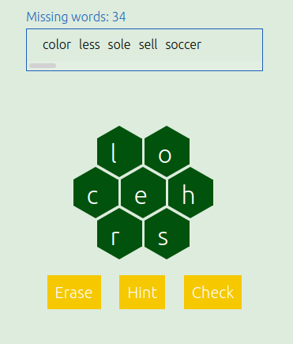

[](https://app.travis-ci.com/danoan/word-detective)
[](https://codecov.io/gh/danoan/word-detective)
[](https://www.codacy.com/gh/danoan/word-detective/dashboard?utm_source=github.com&amp;utm_medium=referral&amp;utm_content=danoan/word-detective&amp;utm_campaign=Badge_Grade)

# Word detective game

Word detective is a puzzle game in which the player should
find all the missing words that can be created using only seven letters.



## Features

*  Generate puzzles from custom text files, e.g. articles, books, list of words.

```bash
./app/render-word-detective/generate-game.sh books/jekyll.txt output/puzzle-html
```

## Dependencies

*  jinja2
*  boost
*  nlohmann/json (shipped with)

## Installation

```cmake
cd ${WORD_DETECTIVE_SOURCE}
mkdir build
cd build
cmake -DCMAKE_INSTALL_PREFIX="${WORD_DETECTIVE_SOURCE}/install" -DCMAKE_BUILD_TYPE="Release" ..
make install
```
